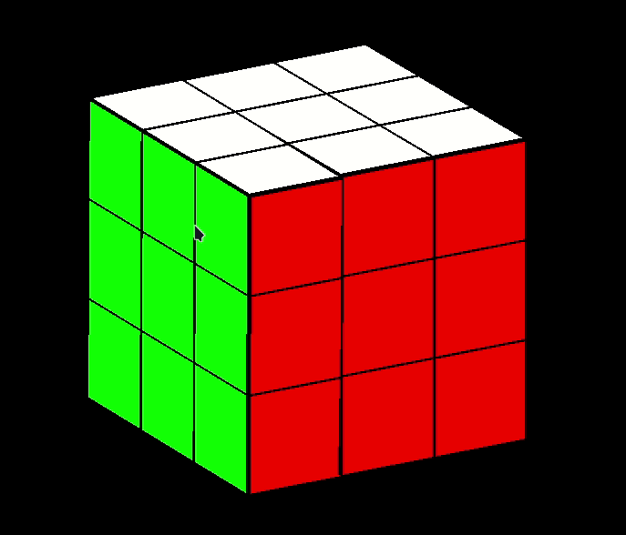

# Rubiks cube simulation in OpenGL

This project is the simulation of 3D Rubiks cube which is done using _C_ and _OpenGl_ Library.

# Installation in Ubuntu

- Install library `sudo apt-get install build-essential`
- Install glut.h library `sudo apt-get install freeglut3-dev`
- Install make `sudo apt-get install make`
- Run `make`
- Run `./rubiks`

# Controls

This **Rubiks Cube** simulation is controlled using Keyboard. The different controls are -

### Quitting the simulation

- `Esc` : Quits the simulation window

### Rotation of Whole cube

- `a` : Rotates Left
- `d` : Rotates Right
- `w` : Rotates Up
- `s` : Rotates Down

### Rotation of sides of the cube by 90 degree

- `t` : Rotates Top clockwise
- `T` : Rotates Top anti-clockwise

- `c` : Rotates Middle from top clockwise
- `C` : Rotates Middle from top anti-clockwise

- `v` : Rotates Bottom clockwise
- `V` : Rotates Bottom anti-clockwise

---

- `f` : Rotates Front clockwise
- `F` : Rotates Front anti-clockwise

- `m` : Rotates Middle from Front clockwise
- `M` : Rotates Middle from Front anti-clockwise

- `b` : Rotates Back clockwise
- `B` : Rotates Back anti-clockwise

---

- `l` : Rotates Left clockwise
- `L` : Rotates Left anti-clockwise

- `x` : Rotates Middle from Left clockwise
- `X` : Rotates Middle from Left anti-clockwise

- `r` : Rotates Right clockwise
- `R` : Rotates Right anti-clockwise

# Demo

